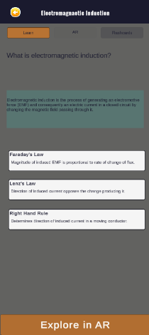
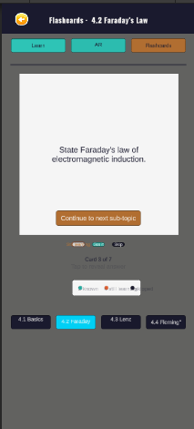

# PhyAR Lab — Testing Report

## 1. Testing Strategies

### 1.1 Unit Testing (Script-level)
Each script was verified independently before integration:

**ModuleLoader:** JSON loading verified for all 9 data files
(3 topics × learn + flashcards + quiz). Confirmed TextAsset 
recognition in Unity Resources folder.

**AppState:** Topic ID correctly passed between screens across 
all three topic selections. Session reset confirmed on GoHome().

**QuizSession:** Score calculation verified:
- All correct → 10/10 ✓
- All skipped → 0/10 ✓
- Mixed answers → correct partial score ✓

**FlashcardSession:** Card advance, sub-topic boundary crossing,
KnownCardIDs accumulation verified in Play mode.

### 1.2 Integration Testing (Screen flow)
Full learning flow tested per topic using DevTestShortcuts:

| Step | EM Induction | Current Electricity | Waves II |
|---|---|---|---|
| Learn content loads | ✓ | ✓ | ✓ |
| Concept cards update | ✓ | ✓ | ✓ |
| Flashcards load correct deck | ✓ | ✓ | ✓ |
| Quiz loads 10 questions | ✓ | ✓ | ✓ |
| Score ring shows correct % | ✓ | ✓ | ✓ |

### 1.3 AR Functional Testing (Device)
Tested on physical Android device:

| Test | Result |
|---|---|
| Plane detection on table | ✓ Detected within 10-15 seconds |
| Plane detection on floor | ✓ Detected within 20 seconds |
| Tap to place circuit | ✓ Circuit appears at tap position |
| Pinch to scale | ✓ Model scales smoothly |
| Single finger rotate | ✓ Model rotates on Y axis |
| Series → Parallel toggle | ✓ Layout switches correctly |
| EM magnet animate cycle | ✓ 3-state cycle works |
| Wave plays/pauses | ✓ Line renderer animates |
| Back button returns to Learn | ✓ AR session stops cleanly |

### 1.4 Edge Case Testing

| Edge Case | Behaviour |
|---|---|
| Tap before plane detected | Hint text shown, no crash |
| Select different topic, re-enter AR | Correct prefab placed for new topic |
| Complete quiz with all skipped | Score 0/10, results screen shows correctly |
| Complete flashcards with all Still Learning | Summary bars show correctly |
| Return to Home mid-quiz | Session reset, quiz restarts fresh |

---

## 2. Different Data Values

### Current Electricity — Ohm's Law verification

| Resistance (Ω) | Voltage (V) | Expected I (A) | App shows | Correct |
|---|---|---|---|---|
| 5 | 6 | 0.600 A | 0.600 A | ✓ |
| 10 | 6 | 0.300 A | 0.300 A | ✓ |
| 20 | 6 | 0.150 A | 0.150 A | ✓ |
| 50 | 6 | 0.060 A | 0.060 A | ✓ |
| 100 | 6 | 0.030 A | 0.030 A | ✓ |

### Waves — Wave equation verification (v = fλ)

| Amplitude | Frequency (Hz) | Wavelength (m) | Expected v (m/s) |
|---|---|---|---|
| 2 cm | 0.5 | 0.10 | 0.050 |
| 5 cm | 1.0 | 0.10 | 0.100 |
| 8 cm | 2.0 | 0.10 | 0.200 |
| 12 cm | 3.0 | 0.10 | 0.300 |

---

## 3. Hardware Performance

| Device Spec | Result |
|---|---|
| Device model | [INSERT YOUR PHONE MODEL] |
| Android version | [INSERT VERSION] |
| RAM | [INSERT RAM] |
| AR plane detection time | ~10-15 seconds indoors |
| Frame rate (AR scene) | ~30 FPS stable |
| APK size | ~[INSERT SIZE] MB |
| App launch time | ~3-4 seconds |

---

## 4. Analysis of Results vs Objectives

### Objective 1 — Understand the gap
The app targets sub-county schools with no physics lab access. 
Testing confirmed the app requires only a flat surface and adequate 
lighting — no specialist hardware. This aligns with the identified gap.

### Objective 2 — Develop the intervention
All three full topics implemented with Learn → AR → Flashcards → Quiz 
flow. AR experiences successfully demonstrated Faraday's Law, Lenz's Law, 
Ohm's Law, and wave properties through interactive 3D models.

### Objective 3 — Evaluate the intervention
System Usability Scale and Student Perceived Learning Questionnaire 
to be administered during school-based data collection. 
Preliminary device testing confirms app stability on target hardware.

### Missed or Partial
- Waves I is 
- Annotation labels on AR models partial — formula label implemented 
  for circuit, state label for EM Induction.